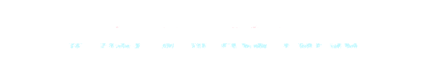
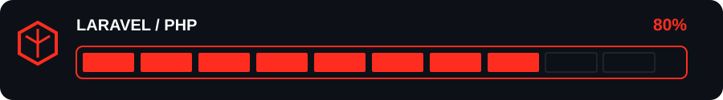
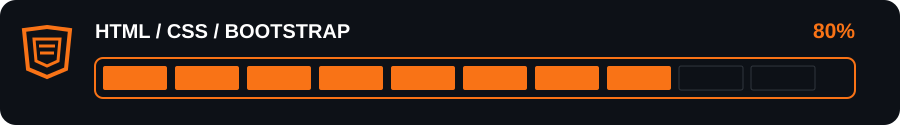
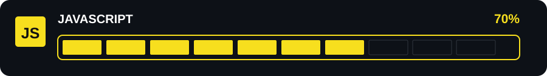
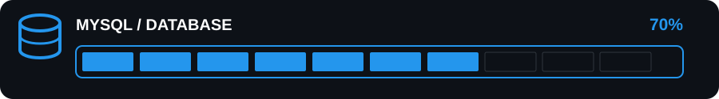
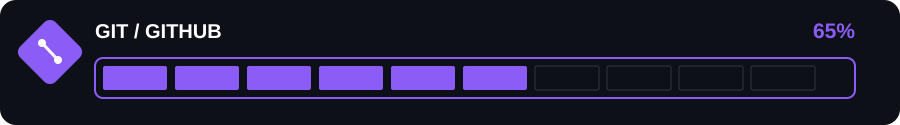

<!-- # 👋 Hi, I'm Ali Parsa -->


### Laravel Developer • PHP Backend Developer • Web Developer

<p align="left">
  <a href="https://github.com/">
    
  </a>
  <a href="#">
    
  </a>
  <a href="#">
    
  </a>
</p>

---

## 🚀 About Me

I'm a **Web Developer focused on Laravel and PHP**, currently growing my skills toward becoming a **Senior Backend Developer**.

I build modern, practical and scalable web applications, with a strong focus on **Laravel, PHP, JavaScript, databases and responsive web interfaces**.

I enjoy turning ideas into real-world applications and continuously improving my code, architecture and problem-solving skills.

> **Building better software, one project at a time. 🚀**

---

## 🧠 My Skills

<p align="center">



<br>



<br>



<br>



<br>



</p>

---

## 🛠️ Tech Stack

### Backend

<p>
  
</p>

### Frontend

<p>
  
</p>

### Database & Tools

<p>
  
</p>

---

## 🔥 What I Build

<table>
<tr>
<td width="50%">

### ⚡ Backend

* Laravel Applications
* REST APIs
* Authentication & Authorization
* MVC Architecture
* Database-driven Systems
* Admin Panels
* Management Systems

</td>
<td width="50%">

### 🎨 Frontend

* Responsive Interfaces
* Bootstrap-based Designs
* JavaScript Interactions
* AJAX Applications
* Dynamic Forms
* RTL Interfaces
* Modern UI Components

</td>
</tr>
</table>

---

## 💻 Development Philosophy

```text
Clean Code       ████████████████████
Problem Solving  ███████████████████░
Backend Focus    ████████████████████
UI & UX          ███████████████████░
Continuous Growth████████████████████
```

I believe good software is not only about making things work.

It's about writing **clean, maintainable and understandable code** that can grow with the project.

---

## 🤝 Let's Connect

I'm always interested in learning, building new projects and connecting with other developers.

<p>
  <!-- <a href="#">
    
  </a> -->
  <!-- <a href="#">
    
  </a> -->
  <a href="https://t.me/Ali_parsa2232" target="_black">
    
  </a>
</p>

---

<p align="center">
  <b>Code. Build. Learn. Improve. 🚀</b>
</p>
